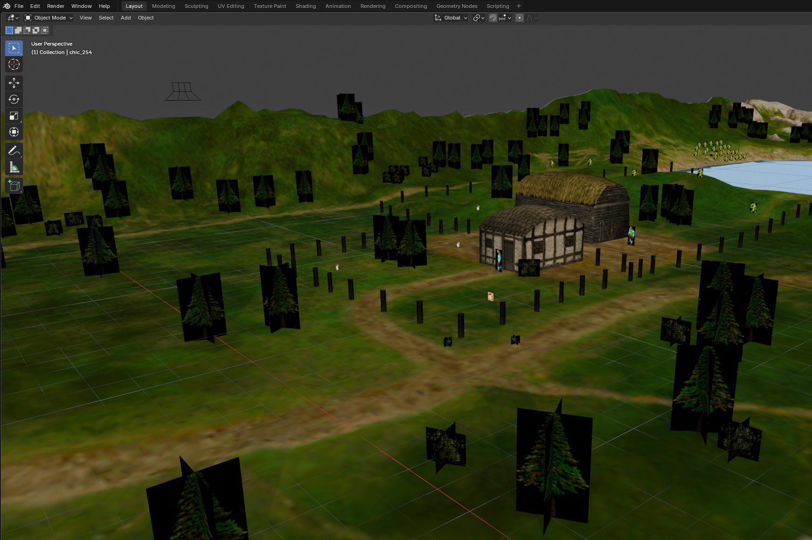

# Myth 2 Map Tools

Small console tools for extracting, editing, and rebuilding **Myth II: Soulblighter** map assets.


## Upfront

This project was originally based on my code and notes from the 1990s, which was made possible in large part by information discovered by many smart and generous map hackers in the Myth:TFL modding community at that time. I compiled the information, discovered some on my own, and I wrote the original code.

The point: I am 65 years old with 3 dogs, a family, and other commitments. I have neither the time nor the inclination to spend days or weeks updating this code for modernity, but I have a lot of nostalgia for Myth OG, Myth 2, and my time in the original Myth modding community. I thought it would be fun to see what could come of these old tools.

And so I did, with the help of both Claude Code and Codex AI coding tools. Without them, I just wouldn't have been able to do this. Regardless of all the hate for "vibe coding," these tools are incredibly useful. No apologies.

This is largely an academic exercise. I know there are other tools out there, and some of this is redundant, but I do hope others may find this project interesting or useful.

## Background

In the late 90s I created software called MythTech for Mac OS. MythTech was, to the best of my knowledge, the first publicly available tool to allow modders to graphically edit Myth: The Fallen Lords map meshes.

The process was a bit of a hack in that MythTech didn't know anything about 3D file formats. All of the exportable map elements were created as image files, which could be brought into Photoshop or other image editing software as layers. It was surprisingly effective for what it was. Using just a grayscale image, 3D terrain could be created and imported back into Myth's mesh files.

MythTech had many other utility functions, but that's the gist of it.

The tools here were based on that old Metrowerks Codewarrior project. First working as MythTech did with Myth: TFL maps, but then moving to focus on Myth II: Soulblighter maps.

## New Workflow

As with the original tools, a map maker can work with 2D images to draw in the terrain type flags, but we can use the displacement.obj in Blender to precisely create terrain flags in 3D at the triangle level.


And, of course, you can use Blender to create or modify the 3D map surface.


And place units, monsters, and sounds. (Models and other assets are export only right now.)




## Authoring Tools

### `extract_map`

```bash
extract_map <tags_folder> <meshtag> [output_folder] [--ora]
extract_map <tags_folder> <meshtag> --out <output_folder> [--ora]
```

First-pass Myth II map extractor. It scans the supplied Myth II tags folder,
finds the requested `mesh` tag and its referenced assets, and writes to
`output_folder`, or to `<meshtag>/` when no output folder is supplied:

- `raw/mesh_tag.bin`
- `terrain/terrain_tag.bin`
- `terrain/terrain.bmp`
- `terrain/shadow.bmp`
- `terrain/water.bmp`
- `terrain/water_mask.bmp`
- `terrain/reflection.bmp`
- `terrain/animation.bmp`
- `terrain/passability.bmp`
- `screens/overhead.bmp` / `pregame.bmp` / `postgame.bmp` when present
- `strings/name.txt`
- `layers/` transparent PNG reference layers plus `layers/manifest.txt`
- `manifest.json`
- `layers/map_layers.ora` when `--ora` is used

`terrain/passability.bmp`, `terrain/water.bmp`, `terrain/water_mask.bmp`,
`terrain/reflection.bmp`, and `terrain/animation.bmp` are written as 4-bit
indexed BMPs. The passability and water pixel indexes are the terrain/media type
values `build_plugin` reads back exactly. For `water.bmp`, indexes `0..3` mean
wet media depths/types; dry pixels use index `6`. `water_mask.bmp` is a simple
light-blue wet-area mask used as the water OBJ texture. `animation.bmp` is a
diagnostic mask: index `0` is off and any nonzero index is on when imported with
`--animation`.

When `--ora` is enabled, the extractor also writes a layered OpenRaster archive
containing the terrain-side layer stack:

- terrain
- shadow
- water
- passability
- reflection
- animation

The loose files in `layers/` are PNGs so overlay/reference layers can carry
transparency in regular image editors. `build_plugin` reimports from the
canonical files under `terrain/`, `screens/`, and `strings/`.

### `build_plugin`

```bash
build_plugin <folder> [output] [--edit] [--obj <input.obj>] [--water-obj <input.obj>] [--heightscale <n>] [--water] [--water-flags] [--animation]
```

Rebuilds a Myth II `dng2` plugin from an extracted map folder. The first pass
packs the mesh plus any extracted terrain, name, and screen tags.

- `--edit` reapplies edited assets from the extracted folder before packing.
- `--obj` imports Myth II terrain displacement from an OBJ into `raw/mesh_tag.bin`.
- If `--obj` is omitted, `build_plugin --edit` auto-detects `<folder>/assets/terrain/displacement.obj`.
- `--water-obj` imports Myth II water-surface heights from an OBJ into wet cells' `media_height`.
- If `--water-obj` is omitted, `build_plugin --edit` auto-detects `<folder>/assets/terrain/water.obj`.
- When a water OBJ is imported, `terrain/water.bmp` is not imported.
- During `--edit`, `terrain/water.bmp` is safely reapplied by default as flags/types only.
- `--water` experimentally imports `terrain/water.bmp` with media-height changes as well.
- `--water-flags` explicitly selects the same safe flags-only `terrain/water.bmp` path.
- `--animation` experimentally imports `terrain/animation.bmp` back into the mesh during `--edit`; it is not imported by default.
- `build_plugin` reads editable assets from the canonical extracted paths:
  - `terrain/terrain.bmp`
  - `terrain/shadow.bmp`
  - `terrain/passability.bmp`
  - `terrain/water.bmp`
  - `terrain/animation.bmp`
  - `screens/overhead.bmp`
  - `screens/pregame.bmp`
  - `screens/postgame.bmp`
  - `strings/name.txt`
  - `assets/sprites/units_edited.json`
- `terrain/terrain.bmp` and `terrain/shadow.bmp` are reinjected into the terrain
  `.256` when present.
- `terrain/passability.bmp` is converted back into Myth II terrain-type flags.
  Indexed BMPs use exact pixel indexes; older RGB BMPs are matched by nearest
  terrain-type color.
- `terrain/water.bmp` is safely reinserted in flags-only form during `--edit`.
  Indexed BMPs use indexes `0..3` as wet media depths/types and all other
  indexes as dry; older RGB BMPs are still supported by color matching.
- `terrain/reflection.bmp` is reinserted into the mesh reflection bit during `--edit`.
- `terrain/reflection.bmp` marks reflective cells from the mesh as a 4-bit indexed mask: index `0` = off, nonzero = reflective.
- `terrain/animation.bmp` marks cells with the animated-media bit as a 4-bit indexed mask: index `0` = off, nonzero = animated.
- In normal engine behavior, the animated-media bit is derived from wet topology: a vertex is marked animated only when the four cells meeting there are all fully wet.
- Because the engine recomputes that bit from topology, `terrain/animation.bmp` is best treated as a diagnostic/reference layer rather than a stable standalone authoring control.
- `screens/pregame.bmp`, `screens/overhead.bmp`, and `screens/postgame.bmp`
  are reinjected into their `.256` tags when present. If a screen `_tag.bin`
  is missing, `build_plugin` can rebuild a single-image `.256` tag directly
  from the matching 8-bit indexed BMP.
- `strings/name.txt` is rebuilt into the map-name `stli` when present.
  If `strings/name_tag.bin` is missing, `build_plugin` can generate this tag
  directly from `strings/name.txt`.
- `assets/sprites/units_edited.json` patches placed unit/monster marker
  positions and facing by marker index.
- `assets/sprites/scenery.json`, `assets/sounds/sounds.json`,
  `assets/models/projectiles.json`, `placement.json`, and
  `assets/models/animations.json` are also treated as marker placement sources
  during `--edit`, so their exported `x`/`y`/`z`/`facing_deg` values can rebuild
  the corresponding scenery, sound, projectile, direct-model, and
  model-animation marker positions.
- `assets/actions/actions.json` rebuilds the map action/script buffer when it
  contains `parameter_data_hex` entries from the current `export_map_actions`.
  The decoded parameter list remains the human-readable view; the hex payload is
  the conservative lossless source used for import.

### `export_mesh`

```bash
export_mesh <tag_folder> [output.obj] [heightscale]
```

Exports an extracted Myth II mesh folder as Wavefront `OBJ`. The exporter uses
the Myth II alternating cell diagonal pattern and a default height scale of
`1/512`.

### `export_water_mesh`

```bash
export_water_mesh <tag_folder> [output.obj] [heightscale]
```

Exports the current Myth II water surface as an OBJ aligned to the terrain OBJ.
It uses `media_height` for vertex Y and writes only wet triangles, with an MTL
that points to the generated `water_mask.png` texture.

### `export_map_objects`

```bash
export_map_objects <tags_folder> <out_folder> [terrain.obj] [--world-space] [--overwrite] [--animation-frame first|none|all]
```

Exports placed map objects and supporting assets from an extracted Myth II mesh
tag (`raw/mesh_tag.bin`). It writes:

- `assets/models/<tag>.obj` + `.mtl` — per-type geometry with UV coordinates
- `assets/terrain/map_combined.obj` + `.mtl` — all scenery instances placed at their
  correct map positions and orientations, ready to import into Blender
- `assets/terrain/displacement.obj` + `.mtl` — terrain displacement mesh
- `assets/terrain/water.obj` + `.mtl` — water surface mesh
- `assets/models/animations.json` plus `assets/models/<anim>_<N>_frame##_*.obj` — model
  animation manifests and frame OBJs for animated map objects such as gates
- `assets/sprites/scenery.obj` plus `assets/sprites/scenery.json` — textured crossed billboards
  and coordinates for sprite-based scenery markers when present
- `assets/sprites/units.obj` plus `assets/sprites/units.json` — textured billboards and
  coordinates for sprite-based monster/unit markers when present
- `assets/sounds/sounds.json` plus `assets/sounds/sounds.obj` — WAV references,
  coordinates, and fallback placeholder geometry for placed sound markers when present
- `assets/sounds/wav/*.wav` — decoded 16-bit PCM WAV files for placed `soun`
  tag permutations
- `assets/models/projectiles.obj` plus `assets/models/projectiles.json` — simple placeholders
  and coordinates for placed projectile markers when present
- `placement.json` — all instance positions (cell coords) and facing angles

When an optional `terrain.obj` path is supplied (e.g. the `displacement.obj`
produced by `export_mesh`), the terrain mesh is appended to `map_combined.obj`
as a separate named object (`o terrain`), giving a single file with both the
terrain surface and all placed scenery.

To preview model animations in Blender, run `tools/import_animations.py`
from Blender's Text Editor and choose the map's `assets/models/animations.json`. The
file picker includes options to import `map_combined.obj`, replace a prior
`myth2_animations` collection, and hide static animation snapshots. Use
`--animation-frame none` when extracting if you want `map_combined.obj` to omit
static animation snapshots and let Blender show only the keyframed frames.

### `export_map_actions`

```bash
export_map_actions <out_folder>
```

Decodes the mesh tag's map action/script buffer from `raw/mesh_tag.bin`. This is
read-only inspection output for understanding map events, triggers, timing, and
references between actions and placed markers. It writes:

- `assets/actions/actions.json` — structured action ids, names, type codes,
  flags, timing, indentation, and typed parameters
- `assets/actions/actions.txt` — compact human-readable action listing

## Example Workflow

On Windows, `extract_assets.bat` runs the common extraction/export sequence in
one step:

```bat
extract_assets.bat myth2_tags le3e out\le3e --overwrite
```

On Linux/macOS, use the Bash version:

```bash
./extract_assets.sh myth2_tags le3e out/le3e --overwrite
```

It runs `extract_map`, `export_mesh`, `export_water_mesh`, `export_map_objects`,
and `export_map_actions`.

To create a Blender scene from an extracted/exported map folder, set
`BLENDER_PATH` or put Blender's executable path in `blender_path.txt`, then run:

```bat
create_blend.bat out\le3e
```

or:

```bash
./create_blend.sh out/le3e
```

The Blender importer uses `assets/terrain/map_combined.obj` when present. If
that OBJ already contains the terrain object, it will not import
`assets/terrain/displacement.obj` a second time. `assets/terrain/water.obj` and
`assets/models/animations.json` are imported when present.

`assets/sprites/units.obj` is imported when present. Moved unit sprites can be
written back to `assets/sprites/units_edited.json` with
`Export All Unit Placements` or `Export Selected Unit Placements` from the
`Myth II` sidebar. During `build_plugin --edit`, that file patches the matching
unit marker positions in the mesh by `marker_idx`.

To add a unit, duplicate an existing unit sprite in Blender, move the duplicate,
then export unit placements. Blender duplicate names such as `.001` are written
as new markers copied from the source unit. The sidebar also has
`Mark Selected As New` and `Mark Selected As Existing` for cases where the
duplicate-name heuristic is not what you want.

`assets/sprites/scenery.obj` is imported into a tag-grouped `scenery`
collection when present, with sprite material transparency enabled. Moved
scenery can be written back with `Export All Scenery Placements` or
`Export Selected Scenery Placements`.

`assets/models/projectiles.obj` is imported into a tag-grouped `projectiles`
collection when present. Moved projectile placeholders can be written back with
the matching projectile placement export buttons. Direct 3D models from
`assets/terrain/map_combined.obj` also receive editable marker origins and can
be written back with the model placement export buttons.

When `assets/sounds/sounds.json` references extracted WAV files, Blender speaker
objects are added at the sound marker locations and `assets/sounds/sounds.obj`
is left as fallback/reference geometry rather than imported by default. If no
speakers can be created, the placeholder OBJ is imported into a tag-grouped
`sounds` collection. Speakers are muted by default so timeline playback does
not trigger every map sound at once.

Blender may disable embedded scripts when the `.blend` opens. Allow script
execution or run the embedded `myth2_sound_tools.py` text block manually. Then
select a speaker and use the `Myth II` tab in the 3D View sidebar, or press F3
and choose `Myth II: Play Selected Sound`.

The same sidebar also includes terrain helpers. Select moved sprites, models,
or speakers and use `Drop Origin To Terrain` to place the Myth marker/origin on
the displacement surface. `Drop Bounds To Terrain` is available as a secondary
bounding-box helper, but exported sprites and models are normally authored with
their origin at ground level.

```bash
extract_map myth2_tags le3e --out out/le3e
export_mesh out/le3e
export_water_mesh out/le3e
export_map_objects myth2_tags out/le3e
build_plugin out/le3e out/le3e_plugin --edit
```

`export_mesh` and `export_water_mesh` write their default OBJs into `assets/terrain/`.
Their MTL files reference PNG textures copied from `layers/`. During `--edit`,
`build_plugin` auto-detects those OBJ files and uses them for terrain and
water-surface geometry.

## Analysis/Debugging Tools

### `core_dump`

```bash
core_dump <file> list
core_dump <file> <id>
```

Dumps a Myth II `core` collection-reference tag in human-readable form.
Useful for inspecting the collection/tint side paired with `medi` tags such as
`wate`, `wagr`, and `wamu`.

### `media_dump`

```bash
media_dump <file> list
media_dump <file> <id>
```

Dumps a Myth II `medi` tag in human-readable form from a foundation, plugin,
or local tag file. `list` enumerates the available `medi` tags in a file.
Useful for inspecting stock media definitions such as `wate`, `wagr`, `wamu`,
and `wame`.

### `media_height`

```bash
media_height <folder> <value>
```

Sets `media_height` to a single signed 16-bit value for every cell in an
extracted Myth II `raw/mesh_tag.bin`. This is a direct experiment tool for
testing what a flat water-surface height does to a map.

### `mesh_diff`

```bash
mesh_diff <folder> <mesh_tag.bin|plugin>
```

Compares the extracted `raw/mesh_tag.bin` in a Myth II folder against another
mesh tag or a rebuilt plugin and reports which per-cell fields changed.

### `mesh_dump`

```bash
mesh_dump <folder> [mesh_tag.bin|plugin] [all|wet]
```

Dumps Myth II mesh cell fields as CSV-style text, with `wet` mode focusing on
cells whose media bits are set.

### `mesh_import`

```bash
mesh_import <tag_folder> <input.obj> [heightscale]
```

Imports an edited Myth II OBJ back into `raw/mesh_tag.bin` by patching
`physical_height` only. Other per-cell fields are preserved.

### `mesh_summary`

```bash
mesh_summary <folder> [mesh_tag.bin|plugin] [all|wet]
```

Groups Myth II mesh cells into repeated flag/height patterns and prints counts
plus a few sample coordinates for each pattern.

### `normal_analyze`

```bash
normal_analyze <folder> [index]
```

Empirically correlates the two stored 8-bit normal indices in each Myth II mesh
cell with geometric triangle normals computed from the displacement mesh.
Without an `index`, it prints one summary row per used normal index. With an
`index` in `0..255`, it prints detailed combined/high-byte/low-byte stats and a
few sample triangles for that index.

### `normal_compare`

```bash
normal_compare <folder>
```

Compares the reconstructed runtime normal table against empirical per-index
triangle-normal buckets from an extracted Myth II mesh. It scores simple
axis/sign permutations and reports the best basis alignment plus the lowest-
error matching indices.

### `normal_table`

```bash
normal_table [index]
```

Reconstructs the Myth II 256-entry precalculated mesh normal table from the
engine-side startup logic reverse-engineered from `Myth II.exe`. Without an
argument, it prints all 256 entries. With an `index` in `0..255`, it prints the
decoded entry with fixed-point components and normalized floating-point values.

### `proj_dump`

```bash
proj_dump <file> list
proj_dump <file> <id>
```

Dumps a Myth II `proj` tag with an emphasis on bounce/collision-relevant
fields such as inertia, detonation/media-detonation frequencies, rebound type,
and projectile flags.

### `tag_dump`

```bash
tag_dump <file>
tag_dump <file> list [type|all]
tag_dump <file> entrypoints
```

Lists tags in Myth II `dng2` plugin files and `mth2` local tag files.

### `water_depth`

```bash
water_depth <tag_folder> <terrain.obj> <water.obj> [level1] [level2] [level3] [output.bmp] [heightscale] [--smooth]
```

Generates a `water.bmp`-style media-type map from the depth between the terrain
OBJ and the water-surface OBJ. Wet triangle placement comes from the water OBJ.
The average triangle depth starts at type `0`, then steps up to types `1`, `2`,
and `3` at the optional raw-height thresholds you provide. `--smooth` runs a
single image-space cleanup pass to reduce isolated jagged triangle spikes.

## Notes

- Myth and Myth II data are **big-endian** (Mac PowerPC lineage). All multi-byte
  integers in tag/archive data are byte-swapped before use.
- `extract_map` scans the supplied Myth II tags folder to locate the requested
  `mesh` tag and its referenced assets rather than relying on hard-coded offsets.
- Image outputs use standard BMP files as editable containers. The games store
  palette-indexed image data internally.
- See `Doc/sprite_storage.md` for the current `.256` sprite/bitmap decoding
  notes.
- See `Doc/sound_storage.md` for the current `soun` tag and WAV extraction
  notes.

## Building

The CMake build is intended to work on Windows and Linux. macOS should also be
straightforward, but has not been exercised as much as the Windows/Linux path.

### With CMake

From the repo root:

```bash
cmake -S . -B build
cmake --build build
```

### Release Build

For single-config generators such as Makefiles or Ninja on Linux/macOS:

```bash
cmake -S . -B build -DCMAKE_BUILD_TYPE=Release
cmake --build build
```

For multi-config generators such as Visual Studio on Windows:

```bash
cmake -S . -B build
cmake --build build --config Release
```

### Build One Tool

```bash
cmake --build build --target extract_map
cmake --build build --target export_mesh
cmake --build build --target export_water_mesh
cmake --build build --target export_map_objects
cmake --build build --target export_map_actions
cmake --build build --target build_plugin
```

With Visual Studio-style generators, include the config:

```bash
cmake --build build --config Release --target extract_map
```

### Clean

```bash
cmake --build build --target clean
```

### Package Release

Configure a Release build first. On Linux/macOS:

```bash
cmake -S . -B build -DCMAKE_BUILD_TYPE=Release
cmake --build build --target package_release
```

On Windows with Visual Studio-style generators:

```bash
cmake -S . -B build
cmake --build build --config Release --target package_release
```

Builds the release executables and writes `dist/myth2ools_<tag>_<platform>.zip`,
where `<tag>` is the latest git tag reported by `git describe --tags --abbrev=0`
and `<platform>` is a normalized OS/architecture suffix such as `windows-x64`,
`linux-x64`, or `macos-arm64`.

### GitHub Release

Pushing a `v*` tag runs the release workflow on GitHub Actions. It builds the
release packages on Windows, Linux, and macOS, then creates or updates the
GitHub Release for that tag with the generated zip files.

```bash
git tag -a v0.3.2 -m "Release v0.3.2"
git push origin v0.3.2
```

### Source Layout

- `tfl/` contains Myth: The Fallen Lords-era tools and exploratory helpers.
- `myth2/` contains Myth II: Soulblighter tools and shared Myth II headers.

### Quick compile (MSVC)

```bash
cl /EHsc /O2 myth2\tag_dump.cpp /Fe:tag_dump.exe
cl /EHsc /O2 myth2\extract_map.cpp /Fe:extract_map.exe
cl /EHsc /O2 myth2\export_mesh.cpp /Fe:export_mesh.exe
cl /EHsc /O2 myth2\export_map_objects.cpp /Fe:export_map_objects.exe
cl /EHsc /O2 myth2\export_water_mesh.cpp /Fe:export_water_mesh.exe
cl /EHsc /O2 myth2\water_depth.cpp /Fe:water_depth.exe
cl /EHsc /O2 myth2\mesh_import.cpp /Fe:mesh_import.exe
cl /EHsc /O2 myth2\mesh_diff.cpp /Fe:mesh_diff.exe
cl /EHsc /O2 myth2\mesh_dump.cpp /Fe:mesh_dump.exe
cl /EHsc /O2 myth2\mesh_summary.cpp /Fe:mesh_summary.exe
cl /EHsc /O2 myth2\normal_analyze.cpp /Fe:normal_analyze.exe
cl /EHsc /O2 myth2\normal_compare.cpp /Fe:normal_compare.exe
cl /EHsc /O2 myth2\normal_table.cpp /Fe:normal_table.exe
cl /EHsc /O2 myth2\media_height.cpp /Fe:media_height.exe
cl /EHsc /O2 myth2\media_dump.cpp /Fe:media_dump.exe
cl /EHsc /O2 myth2\core_dump.cpp /Fe:core_dump.exe
cl /EHsc /O2 myth2\proj_dump.cpp /Fe:proj_dump.exe
cl /EHsc /O2 myth2\build_plugin.cpp /Fe:build_plugin.exe
```

### Quick compile (GCC / Clang)

```bash
g++ -std=c++17 -O2 myth2/tag_dump.cpp -o tag_dump
g++ -std=c++17 -O2 myth2/extract_map.cpp -o extract_map
g++ -std=c++17 -O2 myth2/export_mesh.cpp -o export_mesh
g++ -std=c++17 -O2 myth2/export_map_objects.cpp -o export_map_objects
g++ -std=c++17 -O2 myth2/export_water_mesh.cpp -o export_water_mesh
g++ -std=c++17 -O2 myth2/water_depth.cpp -o water_depth
g++ -std=c++17 -O2 myth2/mesh_import.cpp -o mesh_import
g++ -std=c++17 -O2 myth2/mesh_diff.cpp -o mesh_diff
g++ -std=c++17 -O2 myth2/mesh_dump.cpp -o mesh_dump
g++ -std=c++17 -O2 myth2/mesh_summary.cpp -o mesh_summary
g++ -std=c++17 -O2 myth2/normal_analyze.cpp -o normal_analyze
g++ -std=c++17 -O2 myth2/normal_compare.cpp -o normal_compare
g++ -std=c++17 -O2 myth2/normal_table.cpp -o normal_table
g++ -std=c++17 -O2 myth2/media_height.cpp -o media_height
g++ -std=c++17 -O2 myth2/media_dump.cpp -o media_dump
g++ -std=c++17 -O2 myth2/core_dump.cpp -o core_dump
g++ -std=c++17 -O2 myth2/proj_dump.cpp -o proj_dump
g++ -std=c++17 -O2 myth2/build_plugin.cpp -o build_plugin
```

---
