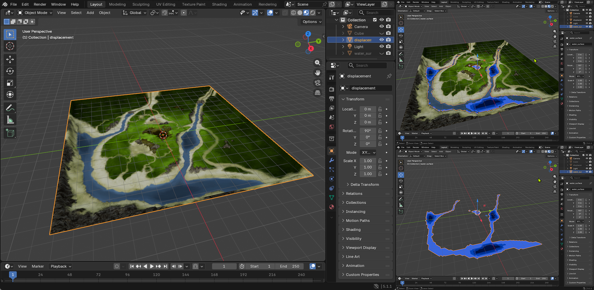
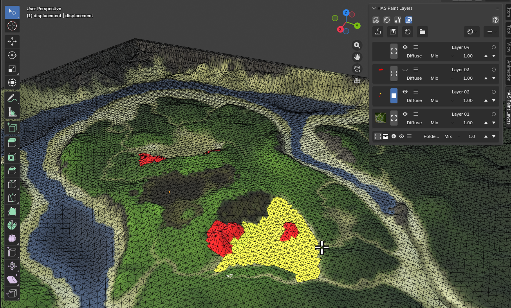
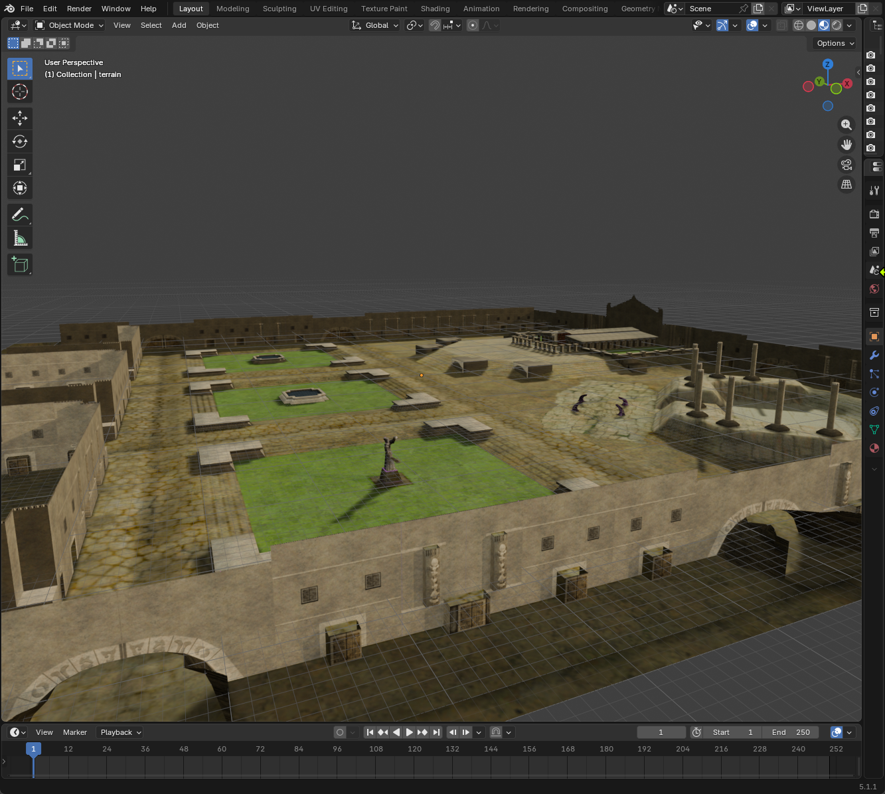

# Myth 2 Map Tools

Small console tools for extracting, editing, and rebuilding **Myth II: Soulblighter** map assets.



## Upfront

This project was originally based on my code and notes from the 1990s, which was made possible in large part by information discovered by many other smart and generous map hackers in the Myth:TFL modding community at that time. I compiled the information, discovered some on my own, and I wrote the original code.

The point: I am 65 years old with 3 dogs, a family, and other commitments. I have neither the time nor the inclination to spend days or weeks updating this code for modernity, but I have a lot of nostalgia for Myth OG, Myth 2, and my time in the original Myth modding community. I thought it would be fun to see what could come of these old tools.

And so I did, with the help of both Claude Code and Codex AI coding tools. Without them, I just wouldn't have been able to do this. Regardless of all the hate for "vibe coding," these tools are incredibly useful. No apologies.

This is largely an academic exercise. I know there are other tools out there, and some of this is redundant, but I do hope others may find this project interesting or useful.

## Background

In the late 90s I created software called MythTech for Mac OS. MythTech was, to the best of my knowledge, the first publicly available tool to allow modders to graphically edit Myth: The Fallen Lords map meshes.

The process was a bit of a hack in that MythTech didn't know anything about 3D file formats. All of the exportable map elements were created as image files, which could be brought into Photoshop or other image editing software as layers. It was surprisingly effective for what it was. Using just a grayscale image, 3D terrain could be created and imported back into Myth's mesh files.

MythTech had many other utility functions, but that's the gist of it.

The tools here were based on that old Metrowerks Codewarrior project. First working as MythTech did with Myth: TFL maps, but then moving to focus on Myth II: Soulblighter maps.

## New Workflow

As with the original tools, a map maker can work with 2D images to draw in the terrain type flags, but we can use the displacement.obj in Blender to precisely create terrain flags in 3D at the triangle level.



And, of course, you can use Blender to create or modify the 3D map surface.

  

## Building

### With CMake

```bash
mkdir build && cd build
cmake ..
cmake --build .
```

### Or choose config

```bash
cmake --build . --config <Release | Debug>
```

### Clean

```bash
cmake --build . --config <Release | Debug> --target clean
```

### Source Layout

- `tfl/` contains Myth: The Fallen Lords-era tools and exploratory helpers.
- `myth2/` contains Myth II: Soulblighter tools and shared Myth II headers.

### Quick compile (MSVC)

```bash
cl /EHsc /O2 myth2\myth2_dump.cpp /Fe:myth2_dump.exe
cl /EHsc /O2 myth2\myth2_extract.cpp /Fe:myth2_extract.exe
cl /EHsc /O2 myth2\myth2_mesh.cpp /Fe:myth2_mesh.exe
cl /EHsc /O2 myth2\myth2_model.cpp /Fe:myth2_model.exe
cl /EHsc /O2 myth2\myth2_water_mesh.cpp /Fe:myth2_water_mesh.exe
cl /EHsc /O2 myth2\myth2_water_depth.cpp /Fe:myth2_water_depth.exe
cl /EHsc /O2 myth2\myth2_mesh_import.cpp /Fe:myth2_mesh_import.exe
cl /EHsc /O2 myth2\myth2_mesh_diff.cpp /Fe:myth2_mesh_diff.exe
cl /EHsc /O2 myth2\myth2_mesh_dump.cpp /Fe:myth2_mesh_dump.exe
cl /EHsc /O2 myth2\myth2_mesh_summary.cpp /Fe:myth2_mesh_summary.exe
cl /EHsc /O2 myth2\myth2_normal_analyze.cpp /Fe:myth2_normal_analyze.exe
cl /EHsc /O2 myth2\myth2_normal_compare.cpp /Fe:myth2_normal_compare.exe
cl /EHsc /O2 myth2\myth2_normal_table.cpp /Fe:myth2_normal_table.exe
cl /EHsc /O2 myth2\myth2_media_height.cpp /Fe:myth2_media_height.exe
cl /EHsc /O2 myth2\myth2_media_dump.cpp /Fe:myth2_media_dump.exe
cl /EHsc /O2 myth2\myth2_core_dump.cpp /Fe:myth2_core_dump.exe
cl /EHsc /O2 myth2\myth2_proj_dump.cpp /Fe:myth2_proj_dump.exe
cl /EHsc /O2 myth2\myth2_assemble.cpp /Fe:myth2_assemble.exe
```

### Quick compile (GCC / Clang)

```bash
g++ -std=c++17 -O2 myth2/myth2_dump.cpp -o myth2_dump
g++ -std=c++17 -O2 myth2/myth2_extract.cpp -o myth2_extract
g++ -std=c++17 -O2 myth2/myth2_mesh.cpp -o myth2_mesh
g++ -std=c++17 -O2 myth2/myth2_model.cpp -o myth2_model
g++ -std=c++17 -O2 myth2/myth2_water_mesh.cpp -o myth2_water_mesh
g++ -std=c++17 -O2 myth2/myth2_water_depth.cpp -o myth2_water_depth
g++ -std=c++17 -O2 myth2/myth2_mesh_import.cpp -o myth2_mesh_import
g++ -std=c++17 -O2 myth2/myth2_mesh_diff.cpp -o myth2_mesh_diff
g++ -std=c++17 -O2 myth2/myth2_mesh_dump.cpp -o myth2_mesh_dump
g++ -std=c++17 -O2 myth2/myth2_mesh_summary.cpp -o myth2_mesh_summary
g++ -std=c++17 -O2 myth2/myth2_normal_analyze.cpp -o myth2_normal_analyze
g++ -std=c++17 -O2 myth2/myth2_normal_compare.cpp -o myth2_normal_compare
g++ -std=c++17 -O2 myth2/myth2_normal_table.cpp -o myth2_normal_table
g++ -std=c++17 -O2 myth2/myth2_media_height.cpp -o myth2_media_height
g++ -std=c++17 -O2 myth2/myth2_media_dump.cpp -o myth2_media_dump
g++ -std=c++17 -O2 myth2/myth2_core_dump.cpp -o myth2_core_dump
g++ -std=c++17 -O2 myth2/myth2_proj_dump.cpp -o myth2_proj_dump
g++ -std=c++17 -O2 myth2/myth2_assemble.cpp -o myth2_assemble
```

---

## Tools

### `myth2_dump`

```bash
myth2_dump <file>
myth2_dump <file> list [type|all]
myth2_dump <file> entrypoints
```

Lists tags in Myth II `dng2` plugin files and `mth2` local tag files.

### `myth2_extract`

```bash
myth2_extract <tags_folder> <meshtag> [output_folder] [--ora]
myth2_extract <tags_folder> <meshtag> --out <output_folder> [--ora]
```

First-pass Myth II map extractor. It scans the supplied Myth II tags folder,
finds the requested `mesh` tag and its referenced assets, and writes to
`output_folder`, or to `<meshtag>/` when no output folder is supplied:

- `raw/mesh_tag.bin`
- `terrain/terrain_tag.bin`
- `terrain/terrain.bmp`
- `terrain/shadow.bmp`
- `terrain/water.bmp`
- `terrain/water_mask.bmp`
- `terrain/reflection.bmp`
- `terrain/animation.bmp`
- `terrain/passability.bmp`
- `screens/overhead.bmp` / `pregame.bmp` / `postgame.bmp` when present
- `strings/name.txt`
- `layers/` transparent PNG reference layers plus `layers/manifest.txt`
- `manifest.json`
- `layers/map_layers.ora` when `--ora` is used

`terrain/passability.bmp`, `terrain/water.bmp`, `terrain/water_mask.bmp`,
`terrain/reflection.bmp`, and `terrain/animation.bmp` are written as 4-bit
indexed BMPs. The passability and water pixel indexes are the terrain/media type
values the assembler reads back exactly. For `water.bmp`, indexes `0..3` mean
wet media depths/types; dry pixels use index `6`. `water_mask.bmp` is a simple
light-blue wet-area mask used as the water OBJ texture. `animation.bmp` is a
diagnostic mask: index `0` is off and any nonzero index is on when imported with
`--animation`.

When `--ora` is enabled, the extractor also writes a layered OpenRaster archive
containing the terrain-side layer stack:

- terrain
- shadow
- water
- passability
- reflection
- animation

The loose files in `layers/` are PNGs so overlay/reference layers can carry
transparency in regular image editors. The assembler reimports from the
canonical files under `terrain/`, `screens/`, and `strings/`.

### `myth2_mesh`

```bash
myth2_mesh <tag_folder> [output.obj] [heightscale]
```

Exports an extracted Myth II mesh folder as Wavefront `OBJ`. The exporter uses
the Myth II alternating cell diagonal pattern and a default height scale of
`1/512`.

### `myth2_model`

```bash
myth2_model <tags_folder> <out_folder> [terrain.obj] [--world-space] [--overwrite] [--animation-frame first|none|all]
```

Extracts 3D scenery models and placement data from an extracted Myth II mesh tag
(`raw/mesh_tag.bin`). For each scenery type that has a `geom` tag, it writes:

- `models/<tag>.obj` + `.mtl` — per-type geometry with UV coordinates
- `models/map_combined.obj` + `.mtl` — all scenery instances placed at their
  correct map positions and orientations, ready to import into Blender
- `models/animations.json` plus `models/<anim>_<N>_frame##_*.obj` — model
  animation manifests and frame OBJs for animated map objects such as gates
- `placement.json` — all instance positions (cell coords) and facing angles

When an optional `terrain.obj` path is supplied (e.g. the `displacement.obj`
produced by `myth2_mesh`), the terrain mesh is appended to `map_combined.obj`
as a separate named object (`o terrain`), giving a single file with both the
terrain surface and all placed scenery.

To preview model animations in Blender, run `tools/import_myth2_animations.py`
from Blender's Text Editor and choose the map's `models/animations.json`. The
file picker includes options to import `map_combined.obj`, replace a prior
`myth2_animations` collection, and hide static animation snapshots. Use
`--animation-frame none` when extracting if you want `map_combined.obj` to omit
static animation snapshots and let Blender show only the keyframed frames.

### `myth2_water_mesh`

```bash
myth2_water_mesh <tag_folder> [output.obj] [heightscale]
```

Exports the current Myth II water surface as an OBJ aligned to the terrain OBJ.
It uses `media_height` for vertex Y and writes only wet triangles, with an MTL
that points to `terrain/water_mask.bmp`.

### `myth2_water_depth`

```bash
myth2_water_depth <tag_folder> <terrain.obj> <water.obj> [level1] [level2] [level3] [output.bmp] [heightscale] [--smooth]
```

Generates a `water.bmp`-style media-type map from the depth between the terrain
OBJ and the water-surface OBJ. Wet triangle placement comes from the water OBJ.
The average triangle depth starts at type `0`, then steps up to types `1`, `2`,
and `3` at the optional raw-height thresholds you provide. `--smooth` runs a
single image-space cleanup pass to reduce isolated jagged triangle spikes.

### `myth2_mesh_import`

```bash
myth2_mesh_import <tag_folder> <input.obj> [heightscale]
```

Imports an edited Myth II OBJ back into `raw/mesh_tag.bin` by patching
`physical_height` only. Other per-cell fields are preserved.

### `myth2_mesh_diff`

```bash
myth2_mesh_diff <folder> <mesh_tag.bin|plugin>
```

Compares the extracted `raw/mesh_tag.bin` in a Myth II folder against another
mesh tag or a rebuilt plugin and reports which per-cell fields changed.

### `myth2_mesh_dump`

```bash
myth2_mesh_dump <folder> [mesh_tag.bin|plugin] [all|wet]
```

Dumps Myth II mesh cell fields as CSV-style text, with `wet` mode focusing on
cells whose media bits are set.

### `myth2_mesh_summary`

```bash
myth2_mesh_summary <folder> [mesh_tag.bin|plugin] [all|wet]
```

Groups Myth II mesh cells into repeated flag/height patterns and prints counts
plus a few sample coordinates for each pattern.

### `myth2_normal_analyze`

```bash
myth2_normal_analyze <folder> [index]
```

Empirically correlates the two stored 8-bit normal indices in each Myth II mesh
cell with geometric triangle normals computed from the displacement mesh.
Without an `index`, it prints one summary row per used normal index. With an
`index` in `0..255`, it prints detailed combined/high-byte/low-byte stats and a
few sample triangles for that index.

### `myth2_normal_table`

```bash
myth2_normal_table [index]
```

Reconstructs the Myth II 256-entry precalculated mesh normal table from the
engine-side startup logic reverse-engineered from `Myth II.exe`. Without an
argument, it prints all 256 entries. With an `index` in `0..255`, it prints the
decoded entry with fixed-point components and normalized floating-point values.

### `myth2_normal_compare`

```bash
myth2_normal_compare <folder>
```

Compares the reconstructed runtime normal table against empirical per-index
triangle-normal buckets from an extracted Myth II mesh. It scores simple
axis/sign permutations and reports the best basis alignment plus the lowest-
error matching indices.

### `myth2_media_height`

```bash
myth2_media_height <folder> <value>
```

Sets `media_height` to a single signed 16-bit value for every cell in an
extracted Myth II `raw/mesh_tag.bin`. This is a direct experiment tool for
testing what a flat water-surface height does to a map.

### `myth2_media_dump`

```bash
myth2_media_dump <file> list
myth2_media_dump <file> <id>
```

Dumps a Myth II `medi` tag in human-readable form from a foundation, plugin,
or local tag file. `list` enumerates the available `medi` tags in a file.
Useful for inspecting stock media definitions such as `wate`, `wagr`, `wamu`,
and `wame`.

### `myth2_core_dump`

```bash
myth2_core_dump <file> list
myth2_core_dump <file> <id>
```

Dumps a Myth II `core` collection-reference tag in human-readable form.
Useful for inspecting the collection/tint side paired with `medi` tags such as
`wate`, `wagr`, and `wamu`.

### `myth2_proj_dump`

```bash
myth2_proj_dump <file> list
myth2_proj_dump <file> <id>
```

Dumps a Myth II `proj` tag with an emphasis on bounce/collision-relevant
fields such as inertia, detonation/media-detonation frequencies, rebound type,
and projectile flags.

### `myth2_assemble`

```bash
myth2_assemble <folder> [output] [--edit] [--obj <input.obj>] [--water-obj <input.obj>] [--heightscale <n>] [--water] [--water-flags] [--animation]
```

Rebuilds a Myth II `dng2` plugin from an extracted map folder. The first pass
packs the mesh plus any extracted terrain, name, and screen tags.

- `--edit` reapplies edited assets from the extracted folder before packing.
- `--obj` imports Myth II terrain displacement from an OBJ into `raw/mesh_tag.bin`.
- If `--obj` is omitted, `myth2_assemble --edit` auto-detects `<folder>/displacement.obj` when present.
- `--water-obj` imports Myth II water-surface heights from an OBJ into wet cells' `media_height`.
- If `--water-obj` is omitted, `myth2_assemble --edit` auto-detects `<folder>/water.obj` when present, then falls back to the old `<folder>/<mesh_tag>_water.obj` name.
- During `--edit`, `terrain/water.bmp` is safely reapplied by default as flags/types only.
- `--water` experimentally imports `terrain/water.bmp` with media-height changes as well.
- `--water-flags` explicitly selects the same safe flags-only `terrain/water.bmp` path.
- `--animation` experimentally imports `terrain/animation.bmp` back into the mesh during `--edit`; it is not imported by default.
- The assembler reads editable assets from the canonical extracted paths:
  - `terrain/terrain.bmp`
  - `terrain/passability.bmp`
  - `terrain/water.bmp`
  - `terrain/animation.bmp`
  - `screens/overhead.bmp`
  - `screens/pregame.bmp`
  - `screens/postgame.bmp`
  - `strings/name.txt`
- `terrain/terrain.bmp` is reinjected into the terrain `.256` when present.
- `terrain/passability.bmp` is converted back into Myth II terrain-type flags.
  Indexed BMPs use exact pixel indexes; older RGB BMPs are matched by nearest
  terrain-type color.
- `terrain/water.bmp` is safely reinserted in flags-only form during `--edit`.
  Indexed BMPs use indexes `0..3` as wet media depths/types and all other
  indexes as dry; older RGB BMPs are still supported by color matching.
- `terrain/reflection.bmp` is reinserted into the mesh reflection bit during `--edit`.
- `terrain/reflection.bmp` marks reflective cells from the mesh as a 4-bit indexed mask: index `0` = off, nonzero = reflective.
- `terrain/animation.bmp` marks cells with the animated-media bit as a 4-bit indexed mask: index `0` = off, nonzero = animated.
- In normal engine behavior, the animated-media bit is derived from wet topology: a vertex is marked animated only when the four cells meeting there are all fully wet.
- Because the engine recomputes that bit from topology, `terrain/animation.bmp` is best treated as a diagnostic/reference layer rather than a stable standalone authoring control.
- `screens/pregame.bmp`, `screens/overhead.bmp`, and `screens/postgame.bmp` are reinjected into their `.256` tags when present.
- `strings/name.txt` is rebuilt into the map-name `stli` when present.

## Notes

- Myth and Myth II data are **big-endian** (Mac PowerPC lineage). All multi-byte
  integers in tag/archive data are byte-swapped before use.
- The program scans the `.gor` file to locate the tag rather than using a hard-coded  
  offset table, so it works with any version of the game files.
- Image outputs use standard BMP files as editable containers. The games store
  palette-indexed image data internally.
